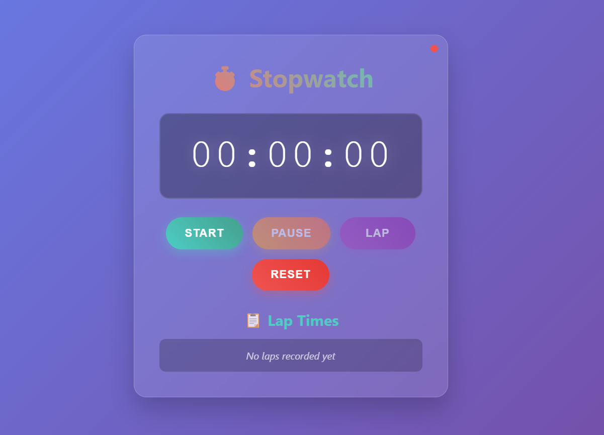

# **⏱️ Stopwatch Pro**

A professional and interactive stopwatch web application with precision timing and lap tracking.

## **📸 Preview**

*Beautiful glassmorphism design with intuitive controls*

## **✨ Features**

* ▶️ **Start/Pause** - Begin and stop timing with precision
* 🔄 **Reset Function** - Clear timer and start fresh
* 📊 **Lap Recording** - Track multiple lap times
* ⌨️ **Keyboard Shortcuts** - Spacebar, L, R keys
* 📱 **Mobile Friendly** - Works on all devices
* 🎨 **Beautiful UI** - Modern glassmorphism design

## **🚀 How to Use**

1. **Download** the HTML file
2. **Open** in any web browser
3. **Start timing** your activities!

## **⌨️ Controls**

* **Start/Pause** - Green/Orange buttons or Spacebar
* **Lap** - Purple button or L key
* **Reset** - Red button or R key

## **🛠️ Technologies**

* HTML5 + CSS3 + Vanilla JavaScript
* No external libraries needed
* Single file application

## **📱 Browser Support**

Works on Chrome, Firefox, Safari, Edge

## **🏃‍♂️ Perfect for**

* Running & Fitness tracking
* Cooking timers
* Study sessions
* Gaming speedruns

## **📝 License**

Open source and free to use.

---

**Made with ❤️ for timing enthusiasts**
